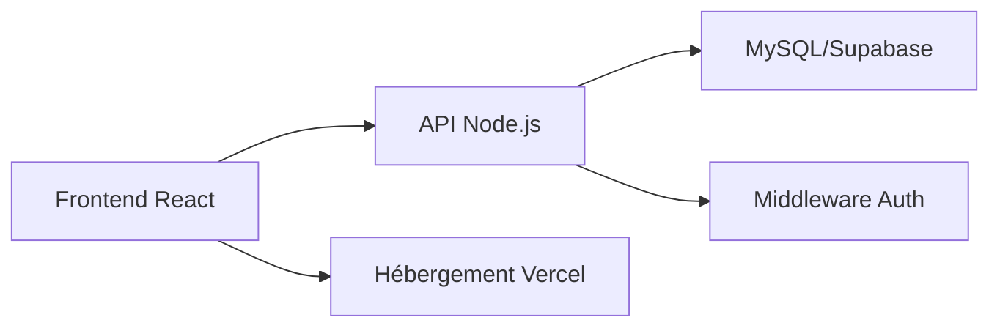

# Documentation externe approfondie : Aventure-Alpine

## Présentation
Aventure-Alpine est une plateforme web collaborative dédiée aux activités de montagne. Elle permet de consulter des articles, des vidéos, des itinéraires, de réserver des expériences, et d’interagir avec une communauté passionnée.

## Historique du projet
- Création : 2024
- Objectif : démocratiser l’accès aux activités alpines
- Évolutions : ajout de la réservation, espace admin, outils interactifs

## Fonctionnalités principales
- Consultation d’articles et de vidéos
- Recherche et affichage d’itinéraires de randonnée, ski, escalade
- Réservation d’activités
- Espace administrateur pour la gestion du contenu
- Outil de test d’expressions régulières (RegexTester)
- Filtrage avancé des expériences
- Système de commentaires et avis

## Architecture technique
- Frontend : React + Vite
- Backend : Node.js (API REST)
- Base de données : MySQL, Supabase
- Hébergement : Vercel
- Tests : Jest

## Structure du projet
- `src/` : Code source React
  - `pages/` : Pages principales
  - `components/` : Composants réutilisables
  - `data/` : Données statiques
  - `api/` : Client API
- `api/` : Endpoints API
- `server/` : Backend Node.js
  - `db/` : Scripts de base de données
  - `middleware/` : Middlewares
- `tests/` : Tests unitaires

## Installation
1. Cloner le dépôt :
   ```bash
   git clone https://github.com/maxlo245/Aventure-Alpine.git
   ```
2. Installer les dépendances :
   ```bash
   npm install
   ```
3. Démarrer le serveur :
   ```bash
   npm run dev
   ```

## Utilisation
- Accéder à l’application via [http://localhost:5173](http://localhost:5173)
- Naviguer entre les pages : Accueil, Articles, Vidéos, Itinéraires, Réservation, Admin, RegexTester
- Utiliser le RegexTester pour valider des expressions régulières

## API
### Endpoints principaux
- `/api/public-articles` : Liste des articles
- `/api/public-routes` : Liste des itinéraires
- `/api/public-sports` : Liste des sports
- `/api/public-videos` : Liste des vidéos
- `/api/public-index` : Index général

### Exemple de requête
```bash
curl http://localhost:5173/api/public-articles
```

### Authentification
- Utilisation de tokens JWT pour l’espace admin
- Middleware d’authentification dans `server/middleware/auth.js`

## Contribution
1. Forker le projet
2. Créer une branche :
   ```bash
   git checkout -b feature/ma-fonctionnalite
   ```
3. Soumettre une Pull Request
4. Respecter les conventions de code et la structure des tests

## Sécurité
- Validation des entrées utilisateur
- Protection contre les injections SQL
- Authentification sécurisée pour l’admin

## Tests
- Lancer les tests avec :
  ```bash
  npm test
  ```
- Couverture des principaux modules

## Roadmap

---

## Présentation approfondie
Aventure-Alpine vise à offrir une expérience complète pour les amateurs de montagne, avec une interface intuitive, des contenus riches, et des outils interactifs.

## Description des modules
- **src/pages/** : pages principales (Accueil, Articles, Vidéos, Itinéraires, Réservation, Admin, RegexTester)
- **src/components/** : composants réutilisables (cards, feed, footer, etc.)
- **src/data/** : données statiques (articles, routes, sports, vidéos)
- **api/** : endpoints publics pour la consultation des données
- **server/** : backend Node.js, gestion des bases de données, middlewares d’authentification
- **tests/** : tests unitaires et d’intégration

## Schéma d’architecture


## Guide d’installation avancé
- Prérequis : Node.js >= 18, npm >= 8, accès internet
- Variables d’environnement à configurer (ex : DB_HOST, DB_USER, DB_PASS)
- Lancer les scripts d’initialisation de la base (`server/db/init-mysql.js`)
- Tester l’installation avec `npm test`

## Tutoriels
- [Installation locale](#installation)
- [Ajout d’un article](src/pages/AdminDashboard.js)
- [Test d’une regex](src/pages/RegexTester.js)

## Explication des endpoints API
- **GET /api/public-articles** : retourne tous les articles
- **GET /api/public-routes** : retourne tous les itinéraires
- **GET /api/public-sports** : retourne tous les sports
- **GET /api/public-videos** : retourne toutes les vidéos
- **GET /api/public-index** : index général
- **POST /api/reservation** : créer une réservation (authentification requise)

## Gestion des erreurs
- Codes HTTP utilisés : 200, 400, 401, 404, 500
- Messages d’erreur détaillés pour chaque endpoint
- Logs côté serveur pour le suivi des incidents

## Sécurité
- Validation stricte des entrées utilisateur
- Utilisation de JWT pour l’authentification admin
- Protection contre les injections SQL et XSS
- Sauvegarde régulière de la base

## Contribution
- Respecter la structure des dossiers
- Documenter chaque nouvelle fonctionnalité
- Ajouter des tests pour chaque PR
- Utiliser des messages de commit explicites

## Tests
- Tests unitaires avec Jest
- Tests d’intégration sur les endpoints API
- Rapport de couverture généré automatiquement

## Roadmap détaillée
- Q1 2026 : carte interactive, notifications push
- Q2 2026 : module de réservation avancé, gestion multi-langues
- Q3 2026 : espace communautaire, gamification

## Support
- Email : maxim [at] aventure-alpine.fr
- Issues GitHub
- Documentation en ligne (Wiki)

## FAQ utilisateur
- **Comment réserver une activité ?**

- **Comment accéder à l’espace admin ?**
## Support et contact
- **Comment tester une regex ?**
- Pour toute question : maxim [at] aventure-alpine.fr

## Liens vers ressources
- [MDN Web Docs](https://developer.mozilla.org/fr/)
- [React](https://react.dev/)
- [Vite](https://vitejs.dev/)
- [Supabase](https://supabase.com/)
- [Jest](https://jestjs.io/)

## Changelog
- 2024-12 : création du projet
- 2025-03 : ajout module réservation
- 2025-06 : intégration Supabase
- 2025-09 : refonte UI
- 2026-02 : documentation enrichie

## Guide de déploiement
- Déploiement automatique sur Vercel via GitHub Actions
- Configuration des variables d’environnement sur Vercel
- Tests exécutés avant chaque déploiement

## Accessibilité
- Interface compatible avec les lecteurs d’écran
- Navigation clavier sur toutes les pages
- Contraste élevé disponible

## Internationalisation
- Prise en charge du français et de l’anglais
- Structure prévue pour ajouter d’autres langues

## Politique de confidentialité
- Les données personnelles ne sont utilisées que pour la réservation
- Conformité RGPD
- Suppression sur demande

- Issues sur GitHub

## Liens externes
- [MDN Web Docs](https://developer.mozilla.org/fr/)
- [React](https://react.dev/)
- [Vite](https://vitejs.dev/)
- [Supabase](https://supabase.com/)

## Licence
MIT

