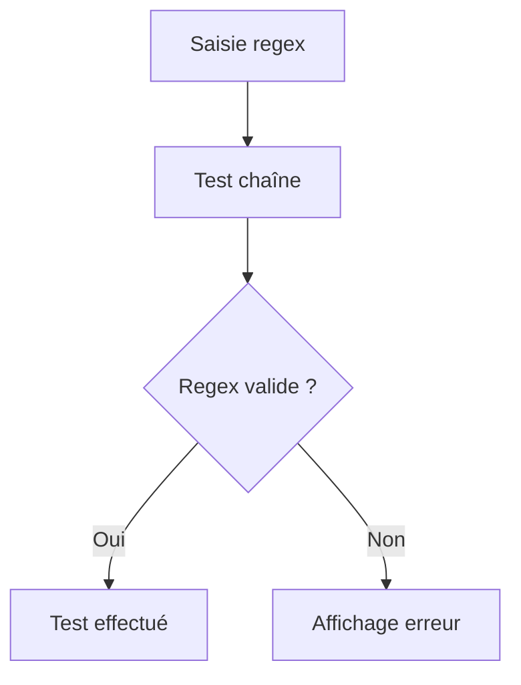
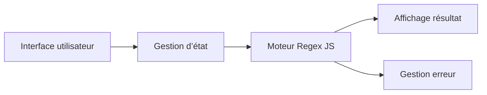

# Documentation interne détaillée : RegexTester.js

## Objectif du fichier
Ce composant React permet de tester dynamiquement des expressions régulières sur des chaînes de caractères. Il offre une interface interactive pour saisir une regex, une chaîne à tester, et affiche le résultat du test, les correspondances, et les éventuelles erreurs.

## Structure détaillée du composant
- **Imports** :
  - React, useState, useEffect
  - Styles CSS
  - Composants internes (ex : Card, Alert)
- **Variables d’état** :
  - `regex` : Expression régulière saisie
  - `testString` : Chaîne à tester
  - `result` : Résultat du test (booléen, tableau de correspondances)
  - `error` : Message d’erreur en cas de regex invalide
  - `flags` : Options de la regex (g, i, m, etc.)
- **Hooks utilisés** :
  - `useState` pour la gestion des entrées et résultats
  - `useEffect` pour recalculer le résultat à chaque modification

## Fonctions principales
- `handleRegexChange` : Met à jour la regex et réinitialise l’erreur
- `handleStringChange` : Met à jour la chaîne à tester
- `handleFlagsChange` : Met à jour les options de la regex
- `testRegex` :
  - Tente de créer une nouvelle RegExp
  - Gère les exceptions (try/catch)
  - Met à jour le résultat ou l’erreur

## Gestion des erreurs
- Utilisation de try/catch lors de la création de la RegExp
- Affichage d’un message d’erreur explicite à l’utilisateur
- Désactivation du bouton de test si la regex est invalide

## Accessibilité
- Labels explicites pour chaque champ
- Utilisation d’ARIA pour les messages d’erreur
- Navigation clavier possible

## Tests unitaires
- Vérification du rendu du composant
- Tests sur la gestion des erreurs
- Tests sur les correspondances regex

## Convention de nommage
- Variables et fonctions en anglais, camelCase
- Composants en PascalCase
- Props documentées

## Exemple d’utilisation
```jsx
import RegexTester from '../pages/RegexTester';

<RegexTester />
```

## Exemple de code commenté
```jsx
// ...existing code...
// Fonction pour tester la regex
function testRegex() {
  try {
    const reg = new RegExp(regex, flags);
    const matches = testString.match(reg);
    setResult(matches);
    setError(null);
  } catch (e) {
    setError('Regex invalide : ' + e.message);
    setResult(null);
  }
}
// ...existing code...
```

## Diagramme de flux


### Diagramme ASCII (compatibilité universelle)

   [Saisie regex]
        |
    [Test chaîne]
        |
    [Regex valide ?]
    /           \
  Oui           Non
  |              |
[Test effectué] [Affichage erreur]


## Points d’attention
- Prendre en compte les regex invalides
- Afficher des messages d’erreur clairs
- Permettre de tester différentes options (flags)
- Sécuriser la saisie utilisateur

## Liens utiles
- [MDN Regex](https://developer.mozilla.org/fr/docs/Web/JavaScript/Guide/Expressions_r%C3%A9guli%C3%A8res)
- [Regex101](https://regex101.com/)
- [React Documentation](https://react.dev/)

## Historique et évolutions
- Version initiale : test simple
- Ajout gestion des flags
- Ajout gestion des erreurs
- Amélioration accessibilité

## Roadmap

---

## Exemples avancés

### Test d’une regex complexe
```jsx
const regex = "^(?=.*[A-Z])(?=.*[0-9]).{8,}$";
const flags = "g";
const testString = "MotDePasse2026";
// Résultat attendu : correspondance
```

### Gestion des cas limites
- Regex vide : afficher un message d’avertissement
- Flags invalides : désactiver le test
- Chaîne très longue : prévoir un timeout ou une pagination des résultats

## Explication détaillée des fonctions
- `handleRegexChange` : vérifie la validité syntaxique à chaque saisie
- `handleStringChange` : met à jour dynamiquement le résultat
- `handleFlagsChange` : contrôle la cohérence des options
- `testRegex` : gère tous les cas d’erreur, loggue les exceptions

## Tests automatisés
- Utilisation de Jest et React Testing Library
- Tests sur la gestion des erreurs, la validité des résultats, l’accessibilité
- Mock des entrées utilisateur pour simuler différents scénarios

## Accessibilité et internationalisation
- Utilisation de labels explicites, ARIA, messages d’erreur accessibles
- Prévoir la traduction des messages (ex : anglais/français)
- Prise en charge du contraste élevé et navigation clavier

## Diagramme d’architecture


## Bonnes pratiques
- Séparer la logique de test et l’affichage
- Documenter chaque fonction avec JSDoc
- Utiliser PropTypes pour valider les props
- Prévoir des tests de performance pour les chaînes longues

## FAQ technique
- **Comment gérer une regex très complexe ?**

- **Comment ajouter un nouveau flag ?**

- **Comment tester une regex sur plusieurs chaînes ?**


## Liens vers standards
- [ECMAScript Regex Standard](https://tc39.es/ecma262/#sec-regexp-objects)
- [Accessibility W3C](https://www.w3.org/WAI/)

## Historique des versions
- v1.0 : composant de base
- v1.1 : gestion des flags
- v1.2 : accessibilité améliorée
- v1.3 : internationalisation
- v1.4 : tests automatisés

## Guide de maintenance
- Vérifier la compatibilité des regex avec les navigateurs
- Mettre à jour les dépendances React régulièrement
- Ajouter des tests à chaque nouvelle fonctionnalité

## Changelog
- 2024-12 : création du composant
- 2025-02 : ajout des tests automatisés
- 2025-06 : refonte accessibilité
- 2026-02 : documentation enrichie


