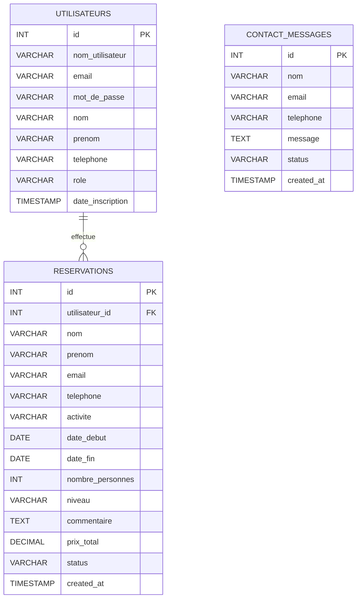

# Schéma de la base de données — Aventure Alpine

Table utilisateurs {

  id INT [pk, increment]

  nom_utilisateur VARCHAR(120) [not null, unique]

  email VARCHAR(180) [not null, unique]

  mot_de_passe VARCHAR(255) [not null]

  nom VARCHAR(120)

  prenom VARCHAR(120)

  telephone VARCHAR(20)

  role VARCHAR(20) [default: 'user']

  date_inscription TIMESTAMP [default: `CURRENT_TIMESTAMP`]

}

Table reservations {

  id INT [pk, increment]

  utilisateur_id INT [ref: > utilisateurs.id]

  nom VARCHAR(120) [not null]

  prenom VARCHAR(120) [not null]

  email VARCHAR(180) [not null]

  telephone VARCHAR(20)

  activite VARCHAR(120) [not null]

  date_debut DATE [not null]

  date_fin DATE

  nombre_personnes INT [default: 1]

  niveau VARCHAR(60)

  commentaire TEXT

  prix_total DECIMAL(10,2)

  status VARCHAR(30) [default: 'en_attente']

  created_at TIMESTAMP [default: `CURRENT_TIMESTAMP`]

}

Table contact_messages {

  id INT [pk, increment]

  nom VARCHAR(120) [not null]

  email VARCHAR(180) [not null]

  telephone VARCHAR(20)

  message TEXT [not null]

  status VARCHAR(30) [default: 'nouveau']

  created_at TIMESTAMP [default: `CURRENT_TIMESTAMP`]

}Table utilisateurs {

  id INT [pk, increment]

  nom_utilisateur VARCHAR(120) [not null, unique]

  email VARCHAR(180) [not null, unique]

  mot_de_passe VARCHAR(255) [not null]

  nom VARCHAR(120)

  prenom VARCHAR(120)

  telephone VARCHAR(20)

  role VARCHAR(20) [default: 'user']

  date_inscription TIMESTAMP [default: `CURRENT_TIMESTAMP`]

}

Table reservations {

  id INT [pk, increment]

  utilisateur_id INT [ref: > utilisateurs.id]

  nom VARCHAR(120) [not null]

  prenom VARCHAR(120) [not null]

  email VARCHAR(180) [not null]

  telephone VARCHAR(20)

  activite VARCHAR(120) [not null]

  date_debut DATE [not null]

  date_fin DATE

  nombre_personnes INT [default: 1]

  niveau VARCHAR(60)

  commentaire TEXT

  prix_total DECIMAL(10,2)

  status VARCHAR(30) [default: 'en_attente']

  created_at TIMESTAMP [default: `CURRENT_TIMESTAMP`]

}

Table contact_messages {

  id INT [pk, increment]

  nom VARCHAR(120) [not null]

  email VARCHAR(180) [not null]

  telephone VARCHAR(20)

  message TEXT [not null]

  status VARCHAR(30) [default: 'nouveau']

  created_at TIMESTAMP [default: `CURRENT_TIMESTAMP`]

}Table utilisateurs {

  id INT [pk, increment]

  nom_utilisateur VARCHAR(120) [not null, unique]

  email VARCHAR(180) [not null, unique]

  mot_de_passe VARCHAR(255) [not null]

  nom VARCHAR(120)

  prenom VARCHAR(120)

  telephone VARCHAR(20)

  role VARCHAR(20) [default: 'user']

  date_inscription TIMESTAMP [default: `CURRENT_TIMESTAMP`]

}

Table reservations {

  id INT [pk, increment]

  utilisateur_id INT [ref: > utilisateurs.id]

  nom VARCHAR(120) [not null]

  prenom VARCHAR(120) [not null]

  email VARCHAR(180) [not null]

  telephone VARCHAR(20)

  activite VARCHAR(120) [not null]

  date_debut DATE [not null]

  date_fin DATE

  nombre_personnes INT [default: 1]

  niveau VARCHAR(60)

  commentaire TEXT

  prix_total DECIMAL(10,2)

  status VARCHAR(30) [default: 'en_attente']

  created_at TIMESTAMP [default: `CURRENT_TIMESTAMP`]

}

Table contact_messages {

  id INT [pk, increment]

  nom VARCHAR(120) [not null]

  email VARCHAR(180) [not null]

  telephone VARCHAR(20)

  message TEXT [not null]

  status VARCHAR(30) [default: 'nouveau']

  created_at TIMESTAMP [default: `CURRENT_TIMESTAMP`]

}
